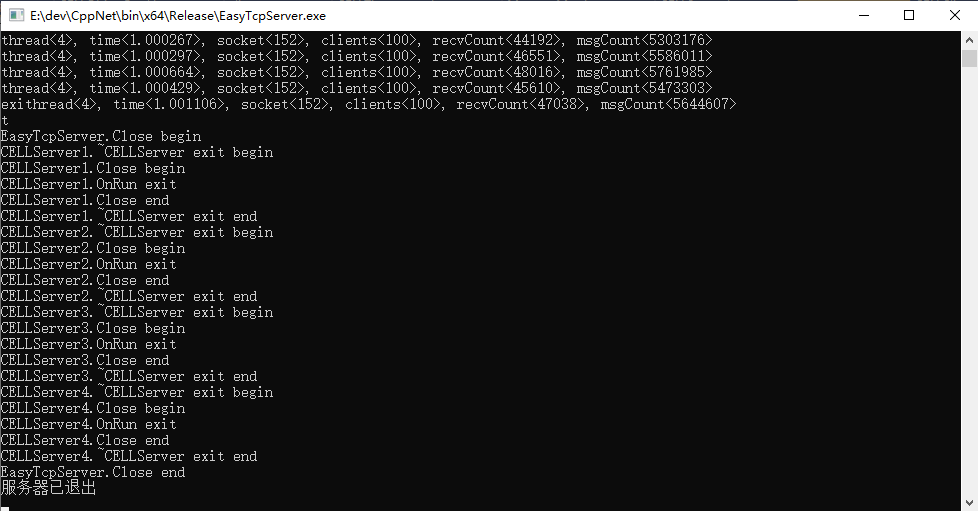

# C++百万并发网络通信引擎架构与实现
depends/include目录下的hpp文件是前后端通用代码。  
EasyTcpServer是服务器项目，EasyTcpClient是客户端项目。  
ByteStream是测试使用字节流的客户端项目。  
其他项目是基础知识学习和测试的项目。  

## Windows平台 Visual Studio 环境编译注意事项
更改调试属性  
项目属性 -> 常规属性  
输出目录：$(SolutionDir)../bin/$(Platform)/$(Configuration)\  
中间目录：$(SolutionDir)../temp/$(Platform)/$(Configuration)/$(ProjectName)\  
  
EasyTcpServer, EasyTcpClient, ByteStream三个项目添加通用代码库  
项目属性 -> C/C++ -> 常规  
附加包含目录：..\depends\include
  
## Linux环境编译命令
服务器：  
g++ server.cpp -std=c++11 -pthread -o server  
./server  
  
客户端：  
g++ client.cpp -std=c++11 -pthread -o client  
./client  
  
##程序运行结果截图  
以Windows环境为例  
###服务器  
  
在命令行输入exit退出服务器  
  
###客户端  
  
  
在命令行输入exit退出客户端  
  
